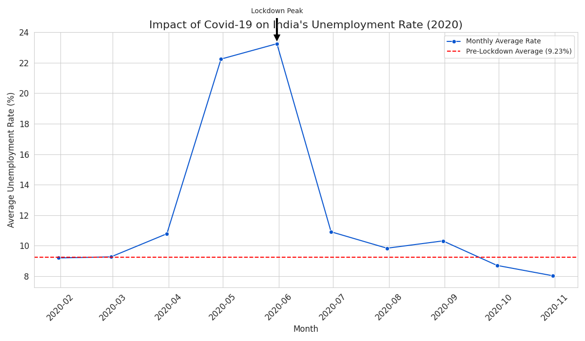

# unemployment-analysis-project
An analysis of India's unemployment rate during the Covid-19 pandemic using Python.
# Unemployment in India During the COVID-19 Pandemic

This is a simple data analysis project that looks at how the unemployment rate in India was affected by the COVID-19 pandemic in 2020. The goal was to use real-world data to see the economic impact of the nationwide lockdown.

## What I Found

The analysis shows a clear story. Before the lockdown (in early 2020), the average unemployment rate was relatively stable. However, there was a dramatic spike in unemployment during the peak lockdown months of April and May. After this peak, the numbers started to slowly come down as the country began to reopen.

Here's the main chart from the analysis that visualizes this trend:



## How to Run This Project

It's pretty straightforward. You just need Python and a few common libraries (pandas, matplotlib, seaborn).

1.  Make sure you have all the files in the same folder:
    * `unemployment_analysis.py` (the main code)
    * `Unemployment_Rate_upto_11_2020.csv` (the dataset)
2.  Run the Python script from your terminal:
    ```bash
    python unemployment_analysis.py
    ```
3.  This will run the analysis and generate the chart `unemployment_rate_over_time.png`.

## The Data

The dataset used is `Unemployment_Rate_upto_11_2020.csv`, which contains monthly unemployment data for different states in India during 2020.
