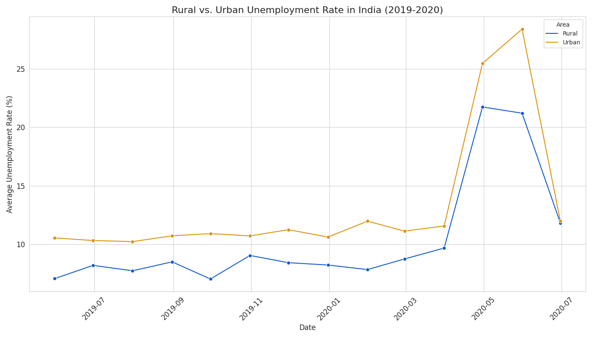

# Unemployment in India During the COVID-19 Pandemic

This project analyzes the impact of the COVID-19 pandemic on unemployment rates in India using two different datasets. The analysis is broken into two parts: a national overview and a comparison between rural and urban areas.

## Part 1: National Unemployment Rate Spike

The first analysis looks at the overall unemployment rate in India during 2020.

### Key Findings
The data clearly shows that the national unemployment rate was stable in early 2020 but spiked dramatically during the lockdown months of April and May. Following this peak, the rate began a slow recovery as the economy started to reopen.


## Part 2: Rural vs. Urban Unemployment

The second analysis uses a different dataset to compare the unemployment trends in rural versus urban parts of the country from 2019 to 2020.

### Key Findings
This comparison reveals that while both areas were impacted by the lockdown, **urban areas consistently had a higher unemployment rate** and saw a more dramatic spike than rural areas.



## How to Run This Project

You just need Python and a few common libraries (pandas, matplotlib, seaborn).

1.  **Make sure you have all the project files in the same folder:**
    * `unemployment_analysis.py` (the main code)
    * `Unemployment_Rate_upto_11_2020.csv` (Dataset 1)
    * `Unemployment in India.csv` (Dataset 2)

2.  **Run the Python script from your terminal:**
    ```bash
    python unemployment_analysis.py
    ```
    This will run both analyses and generate the two charts: `unemployment_rate_over_time.png` and `rural_vs_urban_unemployment.png`.

## The Data

This project uses two datasets:
1.  `Unemployment_Rate_upto_11_2020.csv`: Contains national unemployment data for 2020.
2.  `Unemployment in India.csv`: Contains unemployment data broken down by Rural and Urban areas from 2019-2020.
